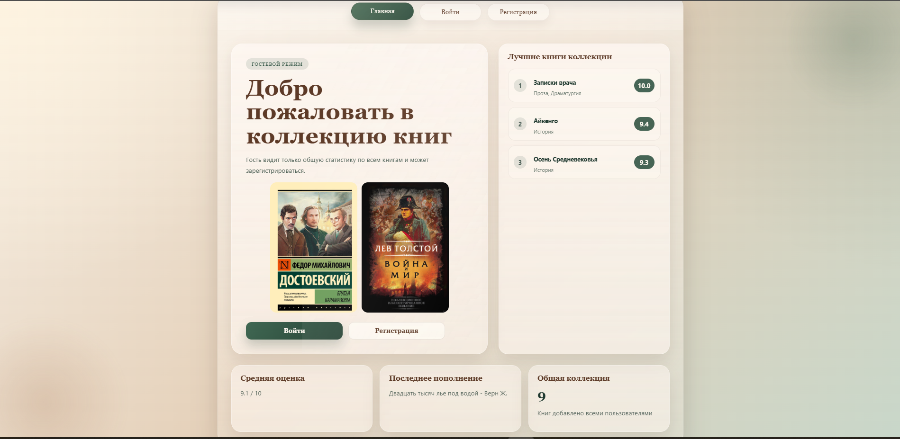
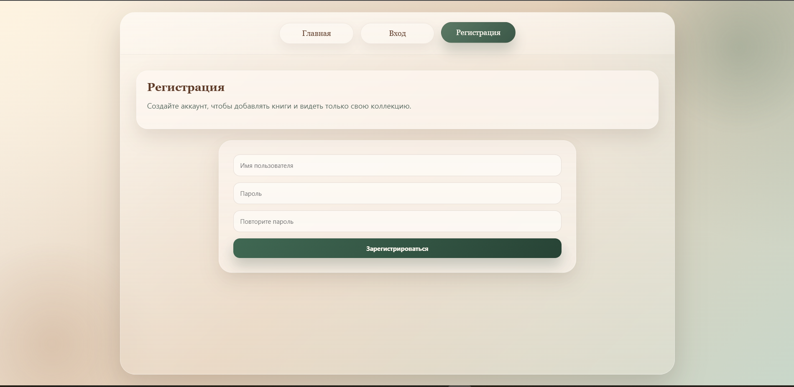
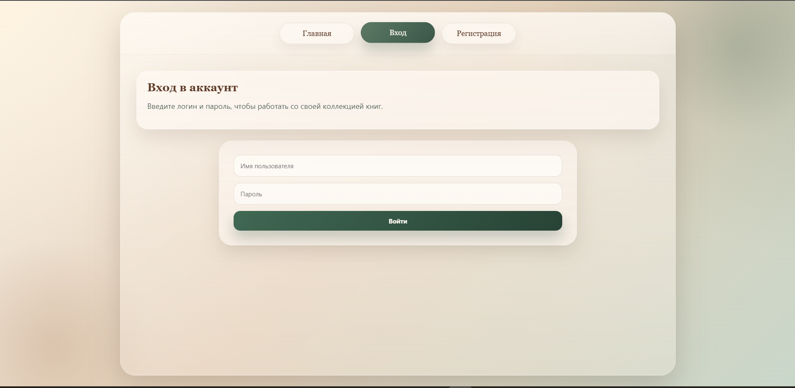
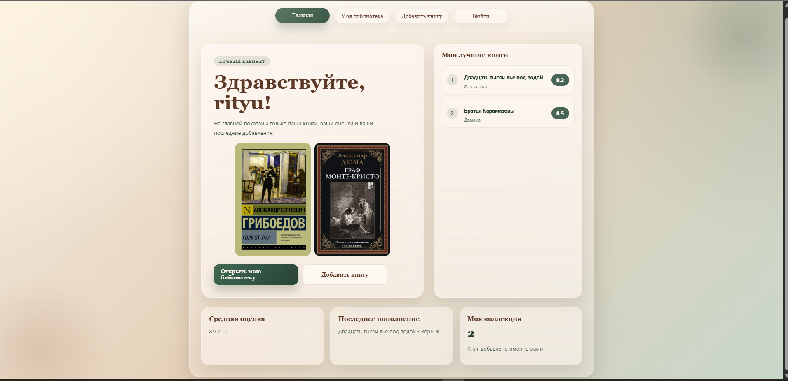
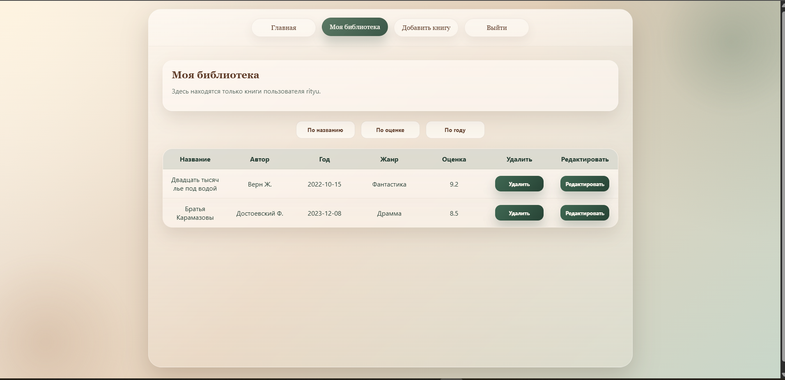
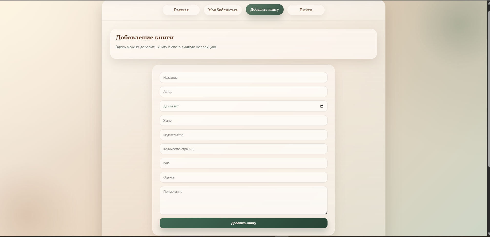

# Индивидуальная работа. Сайт "My own library"

- Выполнил студент: Борисенко Дарья, Клинчев Андрей
- Группа: IA2403
- Преподаватель: Нартя Никита

## Цель работы

Создать сайт для ведения личной библиотеки книг на PHP.  
В проекте нужно было реализовать регистрацию и авторизацию пользователей, работу с базой данных, добавление и редактирование книг, сортировку коллекции, а также отдельный режим для гостя и авторизованного пользователя.


## Инструкции по запуску проекта

Проект находится в папке `project` и запускается через Docker.

```bash
cd project
docker compose up --build
```

После запуска сайт будет доступен по адресу:

```text
http://localhost:8080
```

В проекте используются три контейнера:

- `web` - PHP-приложение с Apache;
- `postgres` - база данных PostgreSQL;
- `redis` - кеш для списков книг.

Если нужно остановить проект:

```bash
docker compose down
```

## Описание проекта

Сайт называется **My own library**. Это небольшая веб-библиотека, где пользователь может создать аккаунт и вести свою коллекцию книг.

Гость видит главную страницу, общую статистику по коллекции и лучшие книги. После регистрации и входа пользователь видит уже только свою библиотеку: свои книги, среднюю оценку, последнее пополнение и топ книг именно из своей коллекции.

Для внешнего вида был сделан спокойный интерфейс в бежево-зеленых тонах. Основные страницы находятся в одном стиле: навигация сверху, карточки статистики, таблицы и формы с одинаковым оформлением.

## Функциональные возможности

Реализовано:

- регистрация нового пользователя;
- вход в аккаунт и выход из аккаунта;
- гостевой режим сайта;
- личный кабинет авторизованного пользователя;
- добавление книги в личную коллекцию;
- просмотр своей библиотеки;
- редактирование книги прямо из таблицы;
- удаление книги;
- сортировка книг по названию, оценке и году;
- вывод средней оценки коллекции;
- вывод последнего добавления;
- вывод лучших книг по рейтингу;
- хранение данных в PostgreSQL;
- кеширование списков книг через Redis;
- защита пользовательских страниц через проверку авторизации.

## Сценарии взаимодействия пользователя с приложением

### 1. Гость открывает сайт

Пользователь заходит на главную страницу без аккаунта. Он видит общую коллекцию, среднюю оценку всех книг, последние добавления и лучшие книги.  
Гость не может добавлять книги, потому что для этого нужна авторизация.

### 2. Регистрация

Пользователь нажимает кнопку `Регистрация`, вводит имя пользователя, пароль и повтор пароля.  
Если данные корректные, аккаунт создается, а пароль сохраняется в базе уже в виде хеша.

### 3. Вход в аккаунт

Пользователь вводит логин и пароль.  
Если данные совпадают с записью в базе, информация о пользователе записывается в `$_SESSION`, и сайт начинает работать в режиме личной библиотеки.

### 4. Добавление книги

Авторизованный пользователь переходит на страницу `Добавить книгу` и заполняет форму:

- название;
- автор;
- дата;
- жанр;
- издательство;
- количество страниц;
- ISBN;
- оценка;
- примечание.

После проверки данных книга сохраняется в таблицу `books`, а в поле `created_by` записывается id текущего пользователя.

### 5. Работа с библиотекой

На странице `Моя библиотека` пользователь видит только свои книги.  
Он может отсортировать таблицу, удалить запись или открыть строку для редактирования.

## Структура базы данных

В проекте используются три таблицы.

### Таблица `users`

Хранит пользователей сайта.

```sql
create table users 
(
    id serial primary key,
    username varchar(100) unique not null,
    password text not null,
    role varchar(20) default 'user'
);
```

- `id` - уникальный идентификатор пользователя;
- `username` - имя пользователя;
- `password` - хеш пароля;
- `role` - роль пользователя.

### Таблица `books`

Хранит книги, добавленные пользователями.

```sql
create table books 
(
    id serial primary key,
    title text not null,
    author text not null,
    year date,
    genre text,
    publisher text,
    pages integer,
    isbn text,
    rating NUMERIC(3,1),
    description text,
    created_by integer,
    foreign key (created_by) references users(id) on delete set null
);
```

- `title` - название книги;
- `author` - автор;
- `year` - дата добавления или год в формате даты;
- `genre` - жанр;
- `publisher` - издательство;
- `pages` - количество страниц;
- `isbn` - ISBN книги;
- `rating` - оценка от 1 до 10;
- `description` - примечание;
- `created_by` - пользователь, который добавил книгу.


## Документация кода

Основная логика разделена по файлам:

- `project/src/backend/backend.php` - подключение к PostgreSQL и Redis, работа с пользователями и книгами;
- `project/src/backend/auth.php` - функции проверки авторизации;
- `project/src/backend/homeData.php` - подготовка данных для главной страницы;
- `project/src/authLogic.php` - регистрация, вход и выход;
- `project/src/subMenus/logic.php` - добавление, редактирование, удаление и валидация книг;
- `project/src/subMenus/library.php` - страница личной библиотеки;
- `project/src/subMenus/form.php` - форма добавления книги.

Для функций добавлены PHPDoc-комментарии.  
Например, функция валидации книги описывает входной массив и возвращаемые ошибки:

```php
/**
 * Проверяет данные формы книги перед добавлением или обновлением записи.
 *
 * @param array $data Поля книги, полученные из POST-запроса.
 * @return array Ошибки, сгруппированные по названию поля.
 */
function validateFormData(array $data): array
```

Для защиты пользовательских страниц используется функция:

```php
/**
 * Разрешает доступ только авторизованным пользователям.
 *
 * @return void Перенаправляет гостей на страницу входа.
 */
function requireAuth(): void
```

## Примеры использования проекта

### Главная страница в гостевом режиме

Гость видит общую статистику и кнопки для входа или регистрации.



### Регистрация пользователя

На этой странице создается новый аккаунт.



### Вход в аккаунт

После входа пользователь получает доступ к личной библиотеке.



### Главная страница авторизованного пользователя

После авторизации главная страница показывает уже личную статистику пользователя.



### Моя библиотека

В таблице отображаются только книги текущего пользователя. Есть сортировка, удаление и редактирование.



### Добавление книги

Форма позволяет добавить новую книгу в личную коллекцию.



### Список добавленных книг на странице формы

После добавления книги можно сразу увидеть в нижней таблице.


## Ответы на контрольные вопросы

### 1. Для чего используется `$_SESSION`?

`$_SESSION` используется для хранения информации о текущем пользователе между запросами.  
В этом проекте после входа в сессию записываются `id` и `username`, поэтому сайт понимает, кто сейчас авторизован.

### 2. Почему пароль нельзя хранить обычным текстом?

Если хранить пароль обычным текстом, при утечке базы данных все пароли сразу будут раскрыты.  
Поэтому в проекте используется `password_hash()`, а при входе пароль проверяется через `password_verify()`.

### 3. Зачем нужны подготовленные запросы PDO?

Подготовленные запросы помогают безопасно передавать данные в SQL-запросы.  
Так уменьшается риск SQL-инъекций, потому что значения передаются отдельно от текста запроса.

### 4. Для чего используется Redis?

Redis используется как кеш для списков книг.  
Например, если пользователь сортирует библиотеку, результат можно временно сохранить и не делать одинаковый запрос к PostgreSQL каждый раз.

### 5. Почему у книги есть поле `created_by`?

Поле `created_by` связывает книгу с пользователем, который ее добавил.  
Благодаря этому каждый пользователь видит только свою коллекцию, а не книги других пользователей.

### 6. Как работает гостевой режим?

Если пользователь не авторизован, сайт показывает общую статистику и общие лучшие книги.  
Для добавления и управления книгами нужно войти в аккаунт.

## Источники

- [Moodle USM](https://elearning.usm.md/course/view.php?id=7161)
- [GitHub devrdn "php materials"](https://github.com/MSU-Courses/advanced-web-development)
- [PHP Data Objects](https://www.php.net/manual/ru/book.pdo.php)
- [Аутентификация пользователей](https://pro-prof.com/forums/topic/аутентификация-пользователей-php-mysql)
